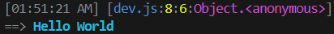

# [@je-es/log](../../../README.md) API

| API             | Desc                              |
| --------------- | --------------------------------- |
| [Log](#log) | Logs a message with optional styling and file logging. |
| [Logger](#logger) | Logger class. |

---

- #### Log

    - **Prototype**

      ```ts
      interface i_log
      {
          level           ?: 'info' | 'warn' | 'error' | 'debug';
          minify          ?: boolean;
          to              ?: 'terminal' | string;
      }
      ```

      ```ts
      const log
      = (msg: string, options: i_log = { })
      : void
      ```

    - **Example**

      ```ts
      import { log } from '@je-es/log';

      log('Test Error !',
      {
          level           : 'error',
          to              : 'terminal',
          minify          : true,
      });
      ```

      _Result_

      


- #### Logger

    - **Prototype**

      ```ts
      interface i_logger
      {
          root            ?: string;
          save            ?: boolean;
          minify          ?: boolean;
      }

      interface i_logger_f
      {
          filePath        ?: string;
          save            ?: boolean;
      }
      ```

      ```ts
      class logger(options: i_logger)
      ```

    - **Example**

      ```ts
      import { logger } from '@je-es/log';

      const log = new logger({ root: './', save: false, minify: true });
      log.info('Hello World', { save: true });
      ```

      _Result_

      

      > Also saved in `root/logs/errors/.log`.

---

> **Made with ❤ by [Maysara Elshewehy](https://github.com/Maysara-Elshewehy)**
